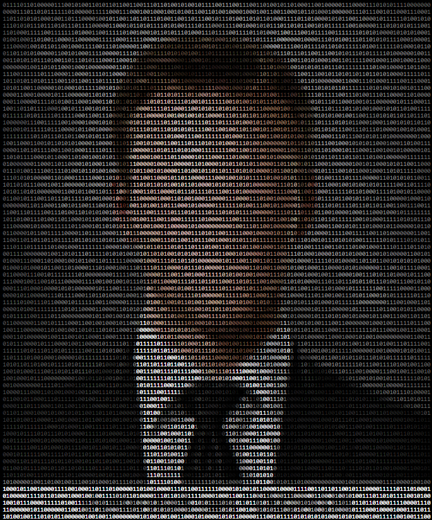
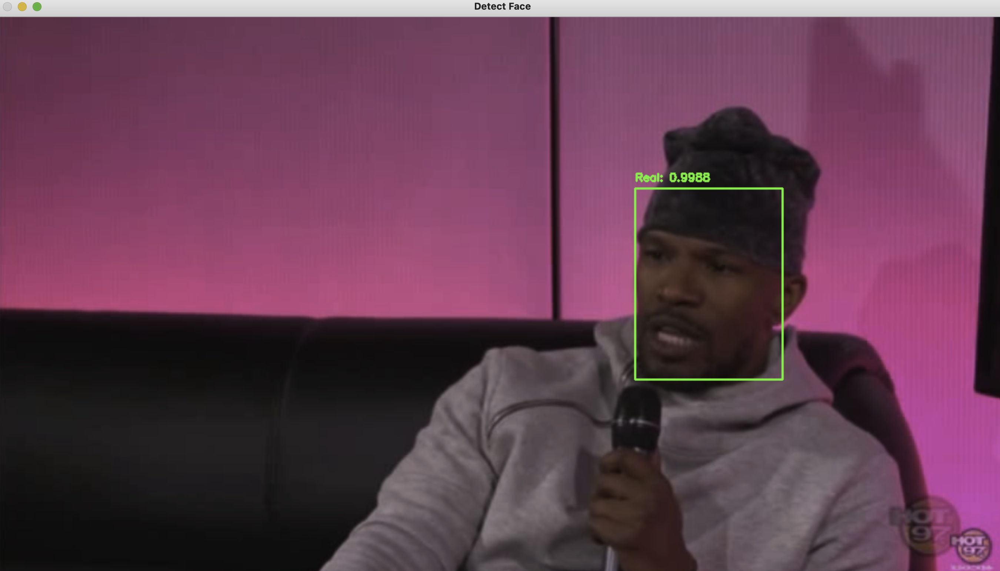
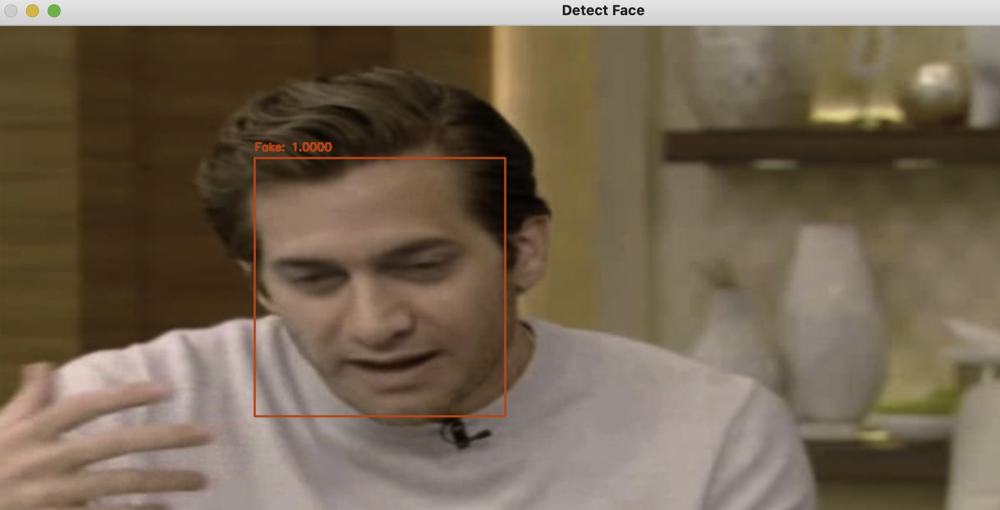
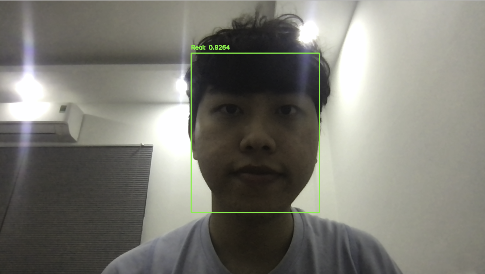

 

Faceless is a deepfake detection system.

## Introduction

The proposed deepfake detection model is based on the EfficientNet structure with some customizations. It is hoped that approachable solution could remind Internet users to stay secure against fake contents and counter the emergence of deepfakes.

The deepfake dataset were used in the final model is [Celeb-DF](https://github.com/yuezunli/celeb-deepfakeforensics)

## Requirement

* Python3 (version >=3.6)

## Installation

### Cloning the repository

```sh
git clone https://github.com/ManhNho/Faceless.git
cd Faceless
```

### Install depedencies

```sh
pip3 install -r requirements.txt
```

### Starting Faceless

```sh
macbook@MacBook Application % python3 faceless.py -h
 
***++++++===================++++***
**++++=====-=+++++++==---=====+++++
**++=====-=*##%%%%%%%**+======+++++
**+++====+##*+****##**#%*====++++++
**++++===#*-::::::--=++*#+===++++++
***+++===#=::::::::-==+**+===+++++*
**++++===*=::::::::-==++*+===+++++*
**++=====+=::::::::--=++*+====++++*
**+++======:::::::---=++++====+++**
**+++++====---::::--=++=+=====+++**
***+++=++++----::---=++========++++
****+++++++==------==++==+++===++++
#****++++++=-===--=+***++++++=++++*
#*******+++..:-=+*###*==+++++++++**
###*******#   .:-+++-:-=#*++++++++*
##########%   .-+++=..:#%%%%#******
#%##%%%%%%%-.=*%#%%+=:-%%%%%%%%%###
#####%%%%%%=::.-%%=-..-%%%%%%%%%%%@
#####%###%%+ ..#%%%-..+%%%%%%%%%%%@
============ .:+==+=. =++++++++++++

Faceless v1.0 - ManhNho
        
usage: faceless.py [-h] -m {1,2}

optional arguments:
  -h, --help            show this help message and exit
  -m {1,2}, --method {1,2}
                        Select method for detect deepfake, Select 1: Define
                        video's local path Select 2: using Webcam
```

## Usage

There are two ways to using Faceless:
* Define video's local path
* Webcam

### First Method: Define video's local path




### Second Method: Webcam



## References

* Model training is handled by [this one](https://github.com/manhnho/Faceless/Training/)

## Authors

ManhNho

## Contributing

Pull requests are welcome. For major changes, please open an issue first to discuss what you would like to change.

## License

[GNU AGPLv3](https://choosealicense.com/licenses/agpl-3.0/)
